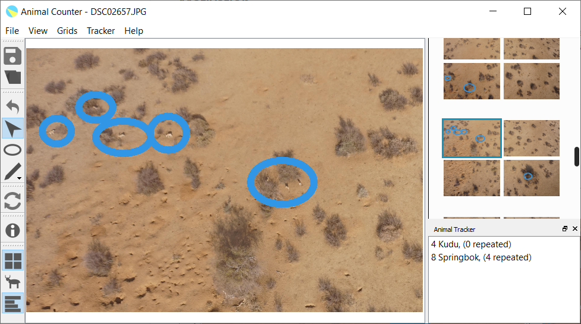
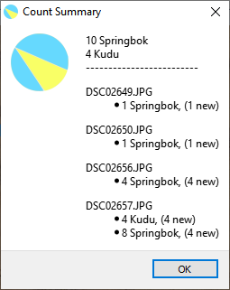

# Game Counter

An application used to help count animals in aerial photographs

To download application, get the setup file from [Releases](https://github.com/nprezant/GameCounterPY/releases/latest).

## Motivation

This project was inspired by the NC State Namibia Wildlife Aerial Observatory research. Drones are used to photograph game lands, and those photographs are processed to determine the number of each species of animal on the land. This application simplifies and speeds up the image processing.

## Features

* Open entire folder (transect) of images at once
* Draw on images to mark animal locations
* Annotate images with animal counts
* View animal count summaries

